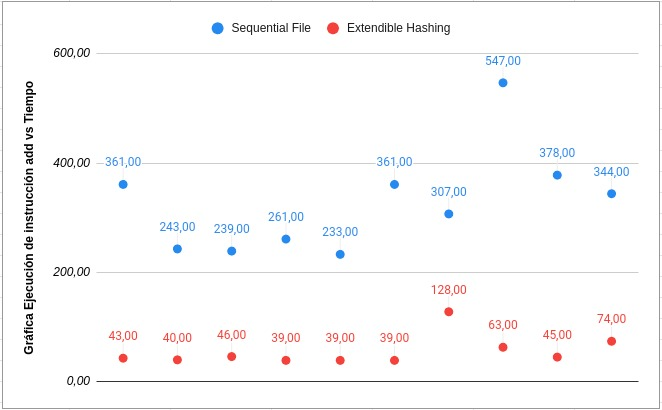

# Proyecto1
 - Eduardo Salas Palacios 201820145
 - Alvaro Aguirre Bernal 201820076
 - Guillermo Sanchez Albarracin 201720046

## Introducción
El objetivo del proyecto es poner en práctica técnicas de organización de archivos implementadas para poder comparar su eficiencia y velocidad.
 
Los datos usados para este proyecto son una elaboración propia. Diseñamos un algoritmo para poder crear dnis, nombres, apellidos, carreras y mensualidades aleatorias. En total emplearemos 100 datos.

En este trabajo se espera poder implementar correctamente dos técnicas de organización de archivos y experimentar con ambas estructuras para poder decidir cual es la mas optima para nuestra base de datos.

## Descripción

Elegimos dos técnicas: Extendible Hashing y Sequential File.

### Extendible Hashing

La primera usa una clase Alumno con atributos de tipo string y un float. Creamos una clase Bucket en la cual declaramos la profundidad local y el tamaño, es decir, cuántos elementos puede tener antes de hacer overflow. Esta clase consta de ocho métodos las cuales explicaremos a continuación.

    - isFull() : Esta función retornará un booleano que indica si el bucket está lleno o no.
    
    - insert(Alumno* key) : Introduce un alumno al bucket por medio de un apuntador a un objeto de la clase Alumno.
    
    - search(string dni) :  Busca la posición en la que se encuentra el alumno por medio de la llave; el Dni.
    
    - copy(vector<Alumno*> &temp) : Copia los alumnos del bucket en un vector temporal.
    
    - display() : Imprime en consola los alumnos insertados en el Bucket.
    
    - increasedepth() : Aumenta la profundidad del bucket a medida que se divida en el directorio principal.
    
    - del(string Key) : Borra un alumno que posee la llave dni.

La clase Directory cuenta con cuatro métodos privados:

    - hash(int n) : Funcion para realizar elhash.

    - split(int bucket_num) : Funcion que se encargara de realizar los splits, dependiendo de si el Global depth = local depth o si el local depth < Global depth.

    - reinsert(int bucket_num) : Volver a insertar los valores luego de un split.

    - Doubledirectory() : Si el Global depth = local depth, se debe hacer un split afectando los directorios, de tener 4 directorios a tener 8 (Formula = 2 elevado a la profundidad global).

También cuenta con métodos públicos:

    - leerAlumnos(string file) : Lee el archivo e inserta los registros en un vector de Alumno.

    - insert(Alumno* key) : Inserta el alumno recibido como parámetro. Si este ya existe, entonces manda un mensaje a consola indicando esto. Si el bucket en donde debe ser insertado está lleno, entonces llama a la función split y luego lo inserta. Finalmente, si el alumno recibido no está registrado aún y hay espacio en su bucket respectivo, entonces lo inserta.

    - del(string dni) : Elimina el registro cuyo dni coincide con el ingresado

    - search(string dni) : Indica si es que la key ingresada (en este caso el dni) se encuentra en algún bucket o no.

    - display() : Muestra los elementos del bucket en consola

### Sequential File

Esta segunda técnica tiene menos complejidad que la primera puesto que hace la inserción de los elementos conforme van llegando y mantiene el archivo 
principal ordenado. Para esto empleamos dos clases: Alumno y SequentialFile.
Por un lado, la clase(struct) Alumno tiene como atributos el DNI, nombre, apellido, carrera y mensualidad. Cada uno de estos como lista de caracteres.
Por otro lado, la clase SequentialFile cuenta con múltiples métodos que serán mostrados a continuación:

    - SequentialFile(string): El constructor de esta clase abrirá el archivo y ordenará todos los alumnos en un vector.

    - insertAll(): Este método ordenará el vector de Alumnos de menor a mayor código. Siguiendo este criterio cambiará el atributo 
                    next(puntero al siguiente alumno) de cada Alumno hacia el siguiente de forma ordenada.

    - add(Alumno):  Añade un Alumno. Si el alumno debe ir al final, lo insertará sin problema. En el caso de que el alumno a insertar se encuentre entre
                    el último y primer alumno entonces lo coloca en el auxiliar. Finalmente cuando el auxiliar esté lleno colocará a todos de forma ordenada dentro del file.

    - Search(long, bool): Va a buscar el alumno gracias al Dni. El booleano verifica si está dentro o fuera del data file (auxiliar).

    - deletion(int): No borra al alumno en su totalidad pero hace que su puntero next apunte a cero. El puntero next del alumno previo apunta al primer
                     next del primer alumno "eliminado".

    - size(const string&): Va a indicar el número de alumnos que tiene el archivo.

    - readRecord(const string&, Alumno& , int): Lee el alumno desde el archivo en la posición dada.

    - writeRecord(const string&, Alumno&, int, bool): Escribe el alumno en el archivo en la posición dada.

    - joinFiles(Alumno&): Une y ordena los archivos en uno solo.

## Pruebas

La simulación de transacciones será realizada de manera manual en la misma presentación para cada estructura de datos, cada metodo sera realizado en un nuevo hilo.
A continuación explicaremos en que consiste cada transacción a realizar en la Base de datos para cada estructura de datos.

### Extendible Hashing

En el EH probaremos corriendo una base de datos universitaria basica de formato .dat, escogiendo principalmente el global depth y el bucket_size = Cuanto aguantara maximo por bucket antes de hacer split, luego aumentara el local depth del bucket partido.
Se escogera manualmente en el terminal una de las opciones, primero tendremos buscar por medio del Dni, luego tenemos la opcion de delete por medio igualmente de Dni, tambien tenemos la opcion de imprimir los datos de las personas, por ultimo la opcion de introducir un nuevo alumno, ingresando los parametros de la clase Alumno de forma manual.

### Sequential File

En el caso de Sequential File generaremos una data con datos reales y apartir de eso iremos insertando y añadiendo alumnos desde el main para que se pueda ir llenando el auxiliar file y sucesivamente observar como se concatena todo en un solo archivo. Adicional a esto borraremos alumnos con nuestra
función deletion y nos percataremos de que el puntero siguiente cambia de valor a cero. Por último, buscaremos un alumno gracias a la posicion que nos brindará el search (binary search).

## Resultados Experimentales

A continuacion veremos los resultados de nuestras operaciones de search y add, en ambas estructuras de forma comparativa. 

.jpeg)

*Tiempos en microsegundos.

## Conclusión

En conclusión, analizando las imágenes comparativas se pudo plantear la solucion optima al problema de la organizacion de los archivos de esta base de datos siendo el Extendible Hashing un método más efectivo y rápido.